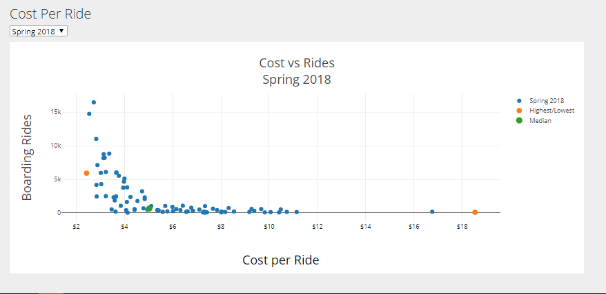

**Introduction**

This project uses ridership, cost, and weather data to find what effect weather
and seasonal changes have on the use of Portland area’s TriMet public
transportation systems. Charts are provided that show the number of riders vs
monthly precipitation, monthly ridership by year, annual number of riders vs
precipitation by month, and cost per ride vs the number of boarding rides. Two
maps are also provided. The transit map shows the number of daily riders for
each stop. The heat map shows ridership density. This project uses public data
from Portland TriMet.

**TriMet Data Analysis**

**Transit Map**

This map was included to allow users to interact with and explore the TriMet
transit system. It contains layers featuring the TriMet service area boundary,
Portland neighborhood boundaries, rail/bus/tram lines and routes, rail/bus/tram
stops and stations, transit centers, and park & ride locations. If the user
clicks on any one of the features represented by a marker, they will be able to
view a popup that will provide basic information about that feature, as well as
ridership data, if available. In addition, when the neighborhood boundaries
layer is selected, users can click anywhere within a given neighborhood to see
the name of that neighborhood.

**Transit Heat Map**

This map was included to provide users with a visual and interactive way to
explore TriMet ridership by stop location and the number of riders who utilize a
given stop. The point intensity of each stop location is determined by the total
number of average users from spring 2018, fall 2018, spring 2019, and fall 2019.
The map also contains layers featuring the TriMet service area boundary,
Portland neighborhood boundaries, and rail/bus/tram stops and stations.

**TriMet Riders v. Precipitation**

This chart was included to help discern whether or not a relationship might
exist between monthly riders and monthly precipitation across the measurement
period (2017-2019) for each transit type (Bus, MAX, WES). There does not seem to
be an obvious relationship between precipitation and ridership when looking only
at the 3 year measurement period.

**Monthly TriMet Riders by Year**

Each chart included in this section shows the monthly ridership (using the
dropdown menu) for each year of the measurement period (2017-2019) for the
associated type

of transit. The chart is colored using the included color scale that is defined
by the total precipitation for the same month and year. The darker the color the
more precipitation there was for the given month.

**Annual TriMet Riders**

To explore both ridership and precipitation across a given calendar year
(2017-2019), a line chart has been included with the radius of the markers
representing the total precipitation for that month. The larger the marker the
higher the total precipitation.

**Cost vs Rides**

The Cost vs Rides chart shows the reported cost per ride vs the number of
boarding rides for each of the four sample periods. The blue dots show the data
for each route. The orange dots show the two routes with the minimum and maximum
cost per ride. The green dot is the point where the median values for each axis
cross. Notice that none of the bus routes make a profit on a per rider basis
based on a \$2.50 cost per ride.

The two routes with the highest cost per rider are Route 97 and Route 152. Route
152 connects Milwaukie with the south end of the Max line and Route 97 connects
Sherwood with the WES in Tualatin indicting that taking a bus to a train is not
very popular. The two routes with the lowest cost per ride is Route 72 going
from Clackamas Towne Center to Gresham to Swan Island and Route 14 going from
downtown Portland to the Max station at Foster and I205. Route 72 is a very long
route going from one of Portland's outlying areas through mature populated areas
to downtown.

**Installation**

The project may be run directly from the GitHub web server.

<https://gary-schulke.github.io/Project2/index.html>

It can also be run locally by cloning the repository. A local file server such
on Python.

*\$ python -m http.server*

**Skill Sets Used**

Python: Jupyter Notebook

Pandas

JSON

JavaScript

D3

Leaflet

Plotly

GeoJSON

JSON

VBA

Scripting

File type conversion

**New JavaScript module:**

Leaflet.MakiMarkers.js

**Other JavaScript modules:**

leaflet-heat.js

leaflet.markercluster.js

**Data Acquisition and Munging**

TriMet provides Geo data for developers with .geojson files for boundaries,
stops, bus routes and rail lines.

The raw data was downloaded from the TriMet website.
(https://trimet.org/about/performance.htm)

Census Reports and Route Ridership Reports were manually downloaded for the
periods Spring 2018,

Fall 2018, Spring 2019, Fall 2019. File names had parentheses “(“, “)” in them
which prevented them from being downloaded and converted from pdf to csv format
programmatically.

The files arrive in PDF format and were converted from PDF to XLSX format using
the online service <https://www.pdftoexcel.com/> and renamed removing the
parentheses.

Each file had multiple sections with headings and descriptive text in each
section and some sections were offset compared to the others. VBA scripts were
used to remove the top heading and name each column. Unwanted columns were
removed. To do this, open each file, import and run the VB script “census.bas”
or “routes.bas”. Run the first Sub in the script.

Data conversion was completed using Jupyter Notebook and Pandas.
“MungingTrimet.ipynb” The notebook has three sections. Section 1 if for census
data, Section 2 is for routes data, and Section 3 adds census data to
“tm_stops.json”. All files are converted to JSON format.

None: File
"stop_level_passenger_census_sorted_by_location_id_weekdaySpring2018.xlsx.csv"

required some manual editing before it would work in pandas. Lines 4825 to 4871.

Historical weather data was obtained from openweathermap.org. The raw data was
downloaded in a .csv file. Data munging/conversion was completed using a Jupyter
Notebook “weather_data.ipynb” and Pandas. Once all cells in the Jupyter Notebook
have run, an output “final_weather_data.json” file is created and stored in the
static/data directory.

**Folder and File Structure**

.**Project2**

\|-- **Documents**

\| \|-- ProjectReport.docx

\| \|-- TeamScrapeShow_Proposal.docx

\| \|-- TrimetMetaData (Metadata for TriMet Geojson files, linked from web
pages)

\|-- **Munging** (Jupyter Notebook, Excel scripts, data files)

\|-- **raw_data** (General storage of raw data)

\|-- **static**

\| \|-- **css**

\| \| \|-- leafletStyle.css

\| \| \|-- plotlyStyle.css

\| \| \`-- style.css

\| \|-- **data** (The final JSON output from munging, data and map overlays)

\| \|-- **icons** (icons used on the map pages)

\| \`-- **js**

\| \|-- config.js (Map API Keys)

\| \|-- leaflet.js (JavaScript for transit map page)

\| \|-- Leaflet.MakiMarkers.js (leaflet custom marker plugin)

\| \|-- leaflet-heat.js (leaflet heatmap plugin)

\| \|-- plotly.js (JavaScript for weather and ridership charts)

\| \|-- plotlyRoutes.js (JavaScript for cost-boarding analysis.)

\| \`-- transitHeatmap.js (JavaScript for heat map page)

\|-- dataSources.html (Links to data and metadata)

\|-- index.html (Launch page)

\|-- leaflet.html (Transit map page)

\|-- plotly.html (Chart page)

\|-- rider_data.ipynb (Jupyter Notebook for rider charts)

\|-- transitHeatmap.html (heatmap page)

\`-- weather_data.ipynb (Jupyter Notebook for weather munging)
